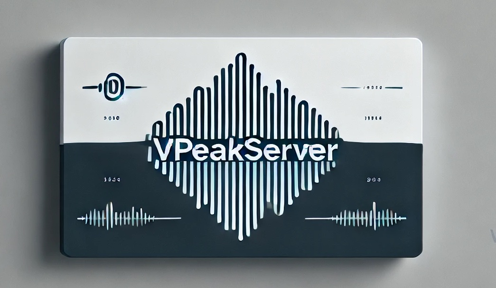

# vpeakserver



A lightweight server for vpeak, providing TTS capabilities via RESTful API.

## Prerequisites
- **Local VOICEPEAK Installation**:
Ensure that [VOICEPEAK](https://www.ah-soft.com/voice/6nare/)  are installed locally on your machine. Refer to their official documentation for installation steps.

## Installation (Recommended)

### macOS (curl)
```sh
curl -fsSL https://raw.githubusercontent.com/shinshin86/vpeakserver/main/install.sh | bash
```

### Windows (PowerShell)
```powershell
irm https://raw.githubusercontent.com/shinshin86/vpeakserver/main/install.ps1 | iex
```

After installation, run the server:

```
vpeakserver
```

Verify the version:

```
vpeakserver --version
```

### Update
Re-run the install command above to update to the latest version.

Install a specific version:

```sh
curl -fsSL https://raw.githubusercontent.com/shinshin86/vpeakserver/main/install.sh | bash -- vX.Y.Z
```

```powershell
irm https://raw.githubusercontent.com/shinshin86/vpeakserver/main/install.ps1 -OutFile install.ps1
.\install.ps1 -Version vX.Y.Z
```

### Uninstall
```sh
rm ~/.local/bin/vpeakserver
```

```powershell
Remove-Item "$env:LOCALAPPDATA\\Programs\\vpeakserver\\vpeakserver.exe"
```

## Installation (Go)

```sh
go install github.com/shinshin86/vpeakserver@latest
```

**Note:**
- By default, the server starts on port `20202`.
- By default, CORS policy mode is set to `localapps`, which automatically allows requests from `localhost` and `app://` origins.
- By default, the user dictionary is the VOICEPEAK native dictionary file resolved by `vpeak`. You can override it with `-user-dict-path`.
- You can specify additional allowed CORS origins using the `-allowed-origin` flag. For example:
  ```sh
  # Allow access from example.com
  vpeakserver -allowed-origin="https://example.com"
  ```
- You can also set the CORS policy mode using the `-cors-policy-mode` flag:
  ```sh
  # Set CORS policy mode to 'all'
  vpeakserver -cors-policy-mode="all"
  ```

## Endpoint
This repository provides a simple HTTP server for handling audio synthesis requests and a VOICEPEAK user dictionary API. It exposes the following endpoints:

1. `/audio_query`: Accepts a POST request with query parameters to return a JSON-encoded `AudioQuery`.
2. `/synthesis`: Accepts a POST request with a JSON body that generates and returns an audio file (`.wav`) synthesized using the specified text and speaker.
3. `/user_dict`: Returns the registered VOICEPEAK user dictionary as a JSON array.
4. `/user_dict_word`: Adds a user dictionary word.
5. `/user_dict_word/by-surface/{surface}`: Updates or deletes a user dictionary word by its current `surface`.
6. `/import_user_dict`: Imports a VOICEPEAK-native dictionary JSON array.
7. `/setting`: Provides a web interface for configuring CORS settings.

## Features
- **Audio Query Endpoint**:  
  Sends a POST request to `/audio_query` with `text` and `speaker` as required query parameters. Optional `emotion`, `speed`, and `pitch` parameters let you mirror the synthesis request and validate them before submission.

- **Audio Synthesis Endpoint**:  
  Sends a POST request to `/synthesis` with a JSON payload including `text`, `speaker`, and optional `emotion`, `speed`, `pitch`. If successful, the server responds with a `.wav` audio file generated by [vpeak](https://github.com/shinshin86/vpeak).

- **User Dictionary API**:
  Adds a VOICEPEAK-native user dictionary API. The server updates VOICEPEAK's actual `dic.json` through [vpeak](https://github.com/shinshin86/vpeak); it does not maintain a separate preprocessing dictionary.

- **Voice Parameter Control**:  
  - `emotion`: Supports `happy`, `fun`, `angry`, `sad` with optional `0`-`100` weights. Examples: `happy`, `happy=50`, `happy=40,fun=60`. Invalid values return `400 Bad Request`.  
  - `speed`: Integer in the range `50`–`200`.  
  - `pitch`: Integer in the range `-300`–`300`.

- **CORS Support**:  
  Configurable via the `-allowed-origin` flag, allowing cross-origin requests from a specified domain (default: `http://localhost:3000`) or from any origin by setting `-allowed-origin=*`.

- **Settings Web Interface**:  
  Access http://localhost:20202/setting to configure CORS policies through a user-friendly web interface. The settings page allows you to:
  - Choose between different CORS policy modes:
    - `localapps`: Restricts CORS to `app://` and `localhost` origins, plus any additional origins specified
    - `all`: Allows all origins (equivalent to setting `-allowed-origin="*"`)
  - Add specific allowed origins (space-separated for multiple origins)
  - Changes to these settings take effect immediately but require a server restart for complete application.

## User Dictionary API

The user dictionary API operates on VOICEPEAK's native dictionary format through `vpeak`.

- `GET /user_dict`
  Returns a JSON array. Each element includes `surface`, `pronunciation`, `priority`, `accent_type`, `pos`, `lang`, and `word_type` when it can be derived from `pos`.
- `POST /user_dict_word`
  Accepts query parameters: `surface`, `pronunciation`, `accent_type`, optional `pos`, optional `word_type`, optional `priority`, optional `lang`. Returns `201 Created` with the created entry.
- `PUT /user_dict_word/by-surface/{surface}`
  Finds an existing entry by its current `surface` and updates it using the same query parameters as `POST`.
- `DELETE /user_dict_word/by-surface/{surface}`
  Deletes an existing entry by `surface`.
- `POST /import_user_dict?override=true|false`
  Accepts VOICEPEAK's native dictionary JSON array. When `override=true`, a single existing entry with the same `surface` is replaced. When `override=false`, a conflicting `surface` returns `409 Conflict`. If multiple existing entries already share the same `surface`, the import also returns `409 Conflict`.

### Validation Policy

- `surface`, `pronunciation`, and `accent_type` are required.
- `pos` or `word_type` is required implicitly. If `pos` is omitted, `word_type` is mapped to a supported VOICEPEAK `pos`, defaulting to `PROPER_NOUN`.
- `priority` must be between `0` and `10`.
- `pronunciation` must be Katakana.
- `surface` is trimmed and minimally normalized for full-width ASCII characters and spaces.
- Duplicate `surface` values are rejected on create and import.
- `POST /import_user_dict?override=false` returns `409` when an imported entry matches an existing `surface`.
- `PUT` / `DELETE` by surface returns `404` when no entry matches and `409` when multiple entries share the same `surface`.
- Malformed JSON bodies are treated as validation errors and return `422`.

### Persistence

- User dictionary data is stored in VOICEPEAK's native `dic.json`.
- The default path is resolved by `vpeak`:
  - macOS: `~/Library/Application Support/Dreamtonics/Voicepeak/settings/dic.json`
  - Windows: `%APPDATA%/Dreamtonics/Voicepeak/settings/dic.json`
- You can change it with:

```sh
vpeakserver -user-dict-path=/path/to/dic.json
```

- Writes are performed atomically using a temporary file, `fsync`, and `rename`.
- The server updates the same dictionary content that VOICEPEAK exports from its UI.

### curl Examples

```bash
curl "http://localhost:20202/user_dict"

curl -X POST "http://localhost:20202/user_dict_word?surface=GitHub&pronunciation=ギットハブ&accent_type=0&priority=5"

curl -X PUT "http://localhost:20202/user_dict_word/by-surface/GitHub?surface=GitHub%20Actions&pronunciation=ギットハブアクションズ&accent_type=1&priority=7"

curl -X DELETE "http://localhost:20202/user_dict_word/by-surface/GitHub%20Actions"

curl -X POST "http://localhost:20202/import_user_dict?override=true" \
  -H "Content-Type: application/json" \
  -d '[
    {
      "sur": "GitHub",
      "pron": "ギットハブ",
      "pos": "Japanese_Koyuumeishi_ippan",
      "priority": 5,
      "accentType": 0,
      "lang": "ja"
    }
  ]'
```

### Example Workflow

1. Fetch `/user_dict` to inspect the current VOICEPEAK dictionary.
2. Detect terms missing from the script, such as `GitHub`, `GitHub Actions`, `feature-flag`, `HTTP2`, or `v1`.
3. Register missing words with `/user_dict_word`.
4. Re-fetch `/user_dict` to confirm registration.
5. Call `/synthesis`; VOICEPEAK uses the updated native dictionary.

## API Notes

- There is currently no built-in OpenAPI generator in this repository.
- The user dictionary API is documented in this README instead.
- This API intentionally does not use AivisSpeech UUID-based word identifiers. It uses `by-surface` operations so it can manage the native VOICEPEAK dictionary without sidecar metadata.
