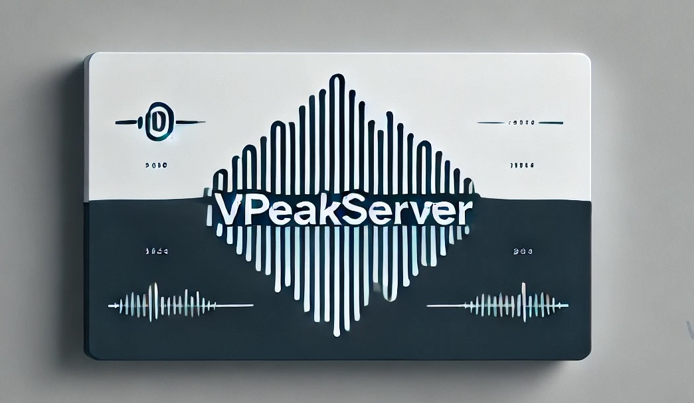

# vpeakserver



A lightweight server for vpeak, providing TTS capabilities via RESTful API.

## Prerequisites
- **Local VOICEPEAK Installation**:
Ensure that [VOICEPEAK](https://www.ah-soft.com/voice/6nare/)  are installed locally on your machine. Refer to their official documentation for installation steps.

## Installation (Recommended)

### macOS (curl)
```sh
curl -fsSL https://raw.githubusercontent.com/shinshin86/vpeakserver/main/install.sh | bash
```

### Windows (PowerShell)
```powershell
irm https://raw.githubusercontent.com/shinshin86/vpeakserver/main/install.ps1 | iex
```

After installation, run the server:

```
vpeakserver
```

Verify the version:

```
vpeakserver --version
```

### Update
Re-run the install command above to update to the latest version.

Install a specific version:

```sh
curl -fsSL https://raw.githubusercontent.com/shinshin86/vpeakserver/main/install.sh | bash -- vX.Y.Z
```

```powershell
irm https://raw.githubusercontent.com/shinshin86/vpeakserver/main/install.ps1 -OutFile install.ps1
.\install.ps1 -Version vX.Y.Z
```

### Uninstall
```sh
rm ~/.local/bin/vpeakserver
```

```powershell
Remove-Item "$env:LOCALAPPDATA\\Programs\\vpeakserver\\vpeakserver.exe"
```

## Installation (Go)

```sh
go install github.com/shinshin86/vpeakserver@latest
```

**Note:**
- By default, the server starts on port `20202`.
- By default, CORS policy mode is set to `localapps`, which automatically allows requests from `localhost` and `app://` origins.
- You can specify additional allowed CORS origins using the `-allowed-origin` flag. For example:
  ```sh
  # Allow access from example.com
  vpeakserver -allowed-origin="https://example.com"
  ```
- You can also set the CORS policy mode using the `-cors-policy-mode` flag:
  ```sh
  # Set CORS policy mode to 'all'
  vpeakserver -cors-policy-mode="all"
  ```

## Endpoint
This repository provides a simple HTTP server for handling audio synthesis requests. It exposes two main endpoints:

1. `/audio_query`: Accepts a POST request with query parameters to return a JSON-encoded `AudioQuery`.
2. `/synthesis`: Accepts a POST request with a JSON body that generates and returns an audio file (`.wav`) synthesized using the specified text and speaker.
3. `/setting`: Provides a web interface for configuring CORS settings.

## Features
- **Audio Query Endpoint**:  
  Sends a POST request to `/audio_query` with `text` and `speaker` as required query parameters. Optional `emotion`, `speed`, and `pitch` parameters let you mirror the synthesis request and validate them before submission.

- **Audio Synthesis Endpoint**:  
  Sends a POST request to `/synthesis` with a JSON payload including `text`, `speaker`, and optional `emotion`, `speed`, `pitch`. If successful, the server responds with a `.wav` audio file generated by [vpeak](https://github.com/shinshin86/vpeak).

- **Voice Parameter Control**:  
  - `emotion`: Supports `happy`, `fun`, `angry`, `sad`. Any other value will be ignored.  
  - `speed`: Integer in the range `50`–`200`.  
  - `pitch`: Integer in the range `-300`–`300`.

- **CORS Support**:  
  Configurable via the `-allowed-origin` flag, allowing cross-origin requests from a specified domain (default: `http://localhost:3000`) or from any origin by setting `-allowed-origin=*`.

- **Settings Web Interface**:  
  Access http://localhost:20202/setting to configure CORS policies through a user-friendly web interface. The settings page allows you to:
  - Choose between different CORS policy modes:
    - `localapps`: Restricts CORS to `app://` and `localhost` origins, plus any additional origins specified
    - `all`: Allows all origins (equivalent to setting `-allowed-origin="*"`)
  - Add specific allowed origins (space-separated for multiple origins)
  - Changes to these settings take effect immediately but require a server restart for complete application.
